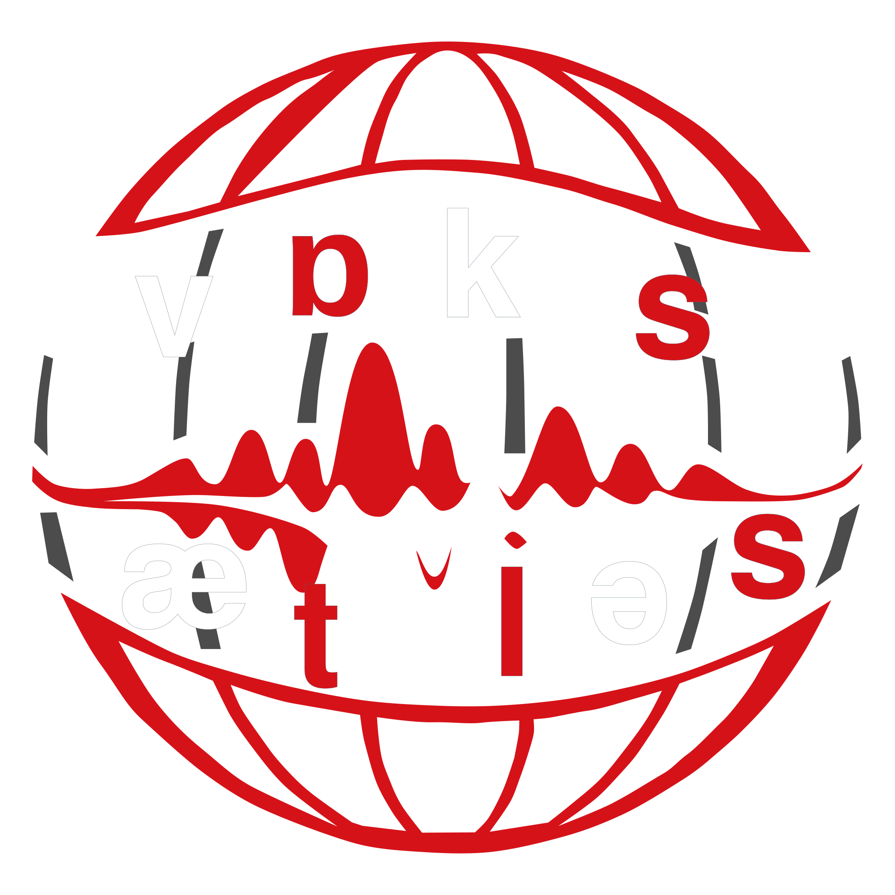

<p align="center">
  
</p>

# VoxAtlas

VoxAtlas is a Python toolkit for extracting and organizing speech, language, and voice features in a modular workflow.

It is designed to make feature pipelines easier to build, extend, and document, with a focus on reusable components and clear outputs.

## Documentation

Full documentation is available on GitHub Pages:

[https://cogsci-hiro.github.io/voxatlas/](https://cogsci-hiro.github.io/voxatlas/)

## What VoxAtlas Helps With

- Running feature extraction workflows on speech and language data
- Organizing extractors into a modular, maintainable pipeline
- Extending the toolkit with new feature definitions and processing steps
- Browsing generated documentation for the API and project guides

## Getting Started

Install the project and its documentation dependencies from the repository root:

```bash
pip install .
pip install -r docs/requirements.txt
```

To build the documentation locally:

```bash
cd docs
make html
```

The generated site will be available at:

```text
docs/_build/html/index.html
```

## Contributing

Contributions are easiest to navigate through the documentation site, which includes guides, tutorials, and generated API reference material.

If you are extending the codebase, the documentation includes the main developer-facing entry points for understanding the feature system and pipeline structure.
